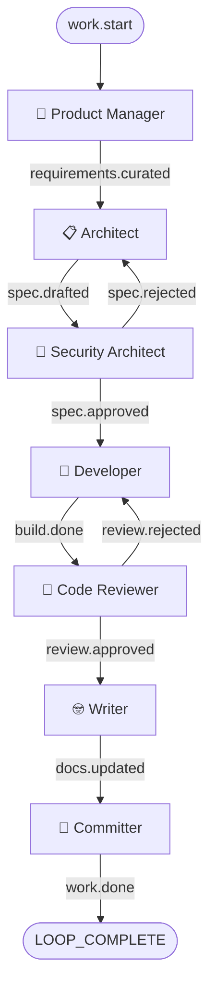

# Multi Hats Ralph

Multiple “multi-hat” RALPH loops designed to tackle features, refactoring, bug fixes, UX exploration, and more using [ralph-orchestrator](https://github.com/mikeyobrien/ralph-orchestrator).

These hats represent my approach to software engineering at a given moment. Feel free to fork them and tweak them to suit your workflow.

## Directory structure

```
specs/
├── architecture/       # System architecture documentation for high-level concepts (authentication, security, ...)
├── completed/          # Historical reference (all work done)
├── guides/             # Consolidated how-to guides (START HERE)
├── pending/            # Features not yet implemented
└── todo/               # TODO that have been identified as part of a feature implementation and that needs to be actioned separately (mainly refactoring)
```

## Hats

| Hat | Role |
|-----|------|
| 🧹 Product Manager | Organizes raw ideas, feature requests, and feedback into well-defined actionable tasks |
| 📋 Architect | Takes curated requirements and writes precise technical specifications |
| 👮 Security Architect | Reviews approved specs for security implications before implementation begins |
| 🔨 Developer | Implements technical specifications, writes code, runs tests |
| 🐍 Code Reviewer | Code review — YAGNI/KISS checks and a Roast My Code review |
| 🤓 Writer | Ensures all documentation is complete, accurate, and polished |
| 👶 Committer | Final validation, git commit, git push, and task archival |

## Workflow

### Specifications

Spec files live in `specs/pending/` for the duration of a task — from the moment the Product Manager creates them to the moment the Committer ships the change. Once fully done (PR open, branch pushed), the Committer moves the file to `specs/completed/` so it serves as a historical record and is never picked up again.

```
specs/pending/   →   (task in progress)   →   specs/completed/
```

### Feature / Refactoring



### Bugfixes

Coming soon!

### UX exploration

Coming soon!

## Setup

1. Copy the scaffold into your project root:

```bash
cp PROMPT.md path/to/project
cp ralph*.yml path/to/project
```

2. Create the directory structure:

```bash
mkdir -p specs/guides specs/architecture specs/completed specs/pending specs/todo
```

3. Tailor the guides to your codebase — the hats reference them directly during implementation and review:

- `specs/guides/coding.md` — coding principles, performance, and security expectations
- `specs/guides/styling.md` — naming, structure, and file placement conventions
- `specs/guides/testing.md` — testing strategy, tools, and coverage expectations

```bash
# The following example is with OpenCode but any AI agent will do.
opencode

"Run PROMPT.md and execute the instructions"
```

4. Run Ralph and take a sip ☕

## Usage

```bash
# Full pipeline for feature / refactoring
ralph run -c ralph.yml
```
